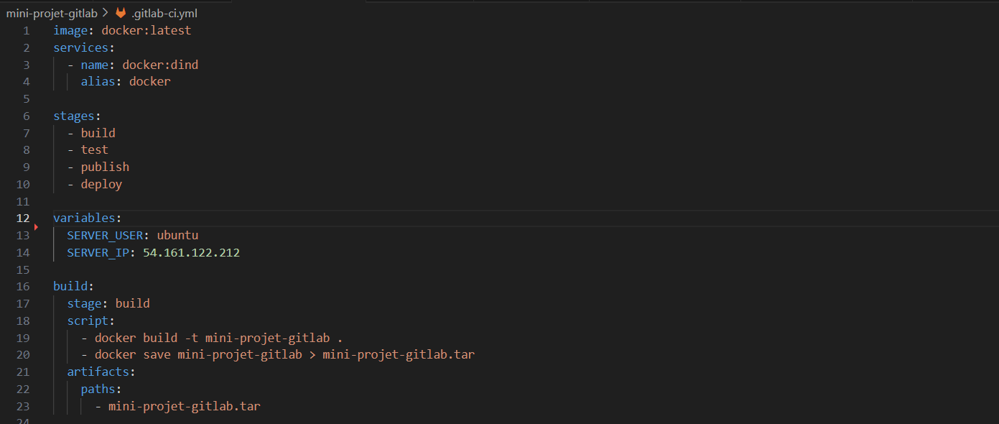

# MISE EN PLACE D’UN CHAINE D'INTÉGRATION CONTINUE ET DE DÉPLOIEMENT CONTINUE AVEC GITLAB CI/CD SUR UN SERVEUR LINUX

  

Notre article s’inscrit dans le cadre des retours des apprenants suite à une demande de comment est ce que nous pouvons déployer nos applications sur des serveurs en entreprises.

  

> **Leur retours:** Bonjour EAZYTraining, nous réalisons les différents projets qui se trouvent sur votre plateforme et nous déployons nos applications sur des environnement tel que Heroku, et eazy labs , c’est super mais en entreprise comment ferions nous pour pouvoir les déployer sur des serveurs ?

  
  

  

# Etapes de mise en place du projet

- Creer des comptes sur AWS & Gitlab

- Récupérer le projet Fil Rouge du cours de Gitlab-CI

- Provisionner l'infrastructure

- Mise en place du pipeline CI/CD vers un serveur Linux

- Vérifier notre infrastructure

  

## Presentation des differents outils et Plateformes

- AWS: c'est une Plateforme Cloud nous proposant Plusieurs services divers nous permettant de mettre en place une infrastructure informatique.
![aws](data:images/jpeg;base64,/9j/4AAQSkZJRgABAQAAAQABAAD/2wCEAAoHCA8PDw8PDxIPDw8QDw8PDw8PEBEPDw8QGBQZGRgUGBgcIS4lHB4rIRkZJ0YmLT0xNjY1GiU7QD4zPy40ODEBDAwMEA8QGhIRGjEhISExNDExNDQ0NDExNDQ0NDQ3MTQ0MTQ0MTE0NDQxMTQ0NDQ0NDQ0NDQxNDE0NDQxMTE0Mf/AABEIAOEA4QMBIgACEQEDEQH/xAAcAAADAAMBAQEAAAAAAAAAAAAAAQIDBgcFBAj/xABBEAACAQMCAggEAgcFCQEAAAABAgADBBEFEiExBgcTIkFRYXEUgYKRMpJCUmJyoaKxIzVDc7M0RFOEwcLD0dIV/8QAGgEAAwEBAQEAAAAAAAAAAAAAAQIDAAQFBv/EAB8RAQEBAQADAQEAAwAAAAAAAAABAhESITFBAxNRcf/aAAwDAQACEQMRAD8A1ctETJJkkz3rp5cyotJLSSZJMS6NMmTJJgTJJkro0hkySYiZJMS6PIZMkmLMCYlppATJJgTJJiWmkBMUIolowGKEUBhCEIoiEITMIQhAIjhHAIjhHFMUI4YmbhYhHCZuPuLRExEySZ6l04OKJkkxEycxbo0iiZJMWYiYlppATETAmImLaaQExEwJkmJabgMUIoloiKEUAiEIRREIQmYQhCARHCMCARHARgRemEeIR4g6PCxHHiGIOjwoSsQm6PGUmTmImLM9G6cPDzETFmGYLR4CYExZizEtNwExQzFFtERQigtERQhFYRQhFEQhCYRCEIGEcI4DCMQAlCLaMhCVACPEFppABGBACMCJaaQoYlYhiDo8LEI8Qm6PE5hmTmGZ6HXFw8xZihB0eCKEUFonFCKL1hFCEXrCKEIBEIQmEQhCZhHCEWmOMCAlARbRkAEYEAJWItppBiAEAJQES00gxHiMCMCC00hYjxHiPEXpuJhLxCDrcfJmKKE9Hrh4cUUIOicUUIOsclmA5kD3OJ0fq96EWl9b/GXZeovaOiUFY00wpHFmXvE5zwBAx5zfsaLpvcJ02zb9VjQpVG9TnvMZO7/DzL88Cop5FT7ESp+j7a90y+zTpVLG64d6mj0axx6rx4TUumPVzb1aVSvp9MULhAW+Hp8KNcDjtCclbyxgZ588jef+x8XHYT1+iAt31GyW5RalvUrCmyOCVYurImR++yTrHS3oVYHT7pra1pUq9Oi9ak1FdjlkG7Zw5hgCuD5w3XLwJOuIQiBm19XGi0r7UQldO0oUqNSu6HOxyCqKrY9Xzjx2eU1vAjVYTu+vdB9OezuFt7WhSr9i7UHprsZaoUlOI5jIGR4icIQ5AI5EZEEvTc4cYnu9CtJW+1G2t3XdR3PUrDOM00Utg48C21fqnSenOg6VZ6Zc1ltLdKhVadFkQKwqOwVWB9MlvZTFtGRxsCVkDnwmydC+ir6pWYFmpW1Laa1VQNxJ5ImeG4458cDnzAPXbfRtJ0umG7O1t1HdNe4Kb29DUfifbMW0Y/Pysp5EfcSwJ3x9d0St3HuNPcHhtqPRKn073Ca5016Jaf8AA1r21ppRqU0FQG3IFGou4AqUHd5E8VxxxzHCLTxygCUBACUBEtPIQErEAJQES00icR4lAR4g6aRGITJthB0ePMhFCel15xxQimE4oQis9ChrN5TtzbU7itTtyxY06blAWPPJXiQfLOPSecAByAHtNl6J9DrrVCXQrQt1ba1w6lgW8Vprw3n5gDzzwnRrTqr0xFxUa6rt4lqgQfIIBw98wXUhpLXFkdkZXRmR0YMjoxV0YcmVhxB9Z+juiuoteafaXNTBqVKCGoQMA1B3XIHh3geE1q56q9Mcdx7uifNKqsPmHUzauj+lLYWlG0V2qLRVgHYAMwLFuIHvE1qUZLHAullv8Nql8tMlSl1UdGHNCzdouPbcPtP0Bot8t5Z29yANteglQqf0Syjcp9jkfKcI6ff3vf8A+cv+mk6N1Paj2lhVtiRuta7bR4ilVy6k/V2n2m1PUrZ+uSatYm1ubm2II7CvVpLniSisQjfNcH5zp3UvY4pXt0c5erTtxnyppvJHuag/LNa617DsdVaoBhbqjSrZ8DUUGmw+yIfqnReg1NLHQrerU4L8PUvahPDuvuq8fZSB8obfTSe3taNq6XbXYT/dbyraN+8iqSfuxHyn5/6QWPwt9d2+ABTuaqoByFMtuT+QrN66ndUZ7m/o1Gy9wi3eOQ7QORUYe/aJ9p5nW1YdlqgrAYW5t6blv1qiZpsPkq0/vF+Xg/Y9TqZ0/NW8uiPwJTt0b1Y73H8tP7zN1x6jlrSyUjhuuqg8RzSn/wCT7TZOrDT/AIfSqLEYe4epcv6hjtQ/kVJyvppqPxep3dUHKLUNGn5bKfcyPQkM31QX6MdO6qEQaUpXG5riuamP192Bn6Qs0jrTWv8A/pk1d3Zdinwuc7dmB2m3w3b858cbc+Enq/6VLp1SpRuN3wtdgxZQWNGoBjfgcSCAAcce6MeM669Oz1CgNwoXdu/EHuVUyPEHwI+4im+PzoBM9KvURHppUqJTfBemjutNyOW5QcNyHPynWNT6sbKplrapVtm8FJ7el9mO7+aaH0g6KXmnd6qoeiW2rXpElMnkGB4offh5ExNdh5ZXggRgRgSwJO1SRIEoCUBKAiXR5EAStsoLHti3QyIxCXtjg8jceHCEJ6ryxCEJhEW0ngvFjwUebHlHESRxU4YcVPkfAzM/Tek2FO0t6NtSGKdGmtNfM4HFj6k5JPmTOAdIulV3qNZ6jVai27M3Y26uyUkpZ7oKg4ZsYyTniTyGAO+6NqNO8tqNzSIKVkDjzU/pKfUHII8wZx/XerTUKNep8HTW5t2djR21KdOpTpk5CsHZRkcsgnOM8M4E8877PfnpplC5q0zmnUqUz503dD91In6C6CPVfSrF6zvUqPR3l6js7srMSpLNxPdInPNB6rbl6iNqDJRojBajSbfWqDxQsO6g9QSeeMcx1XS7u2qqyWr02S3c2zLSIK0nRR/Z8OWARNqytmccG6ff3vf/AOcv+mk9Tqo1LsNUWkThLqk9HHh2iDtEJ+SuPrh1q6W1vqbV/wDDvFWqp8qiKqOv8Eb65qNldPb1qVwnF6FVKygHG5kYNt9jjHzjfYX5XXOt3R2uaVg9Mf2nxa2m4cdq3GFDH61QfVPV6xrlbTRa1NML2i0rOmp/UYgMv5A/2my4pXNKm/B6b9jcUzzHdZaiMPmFM5v1z33+w2o86ty48QQAiffdU+0Se+Q1af0AvvhtWs3JwlSobd/2hUUoo/OUPym/9b2mNXoWVSmuai3Pwy+GO3GBn6kQfVOQ06joyuhw6MrofJ1OVP3An6TpijfW9vUID03+Gu6foVZatNh7ELNpo+LWblNL0uq9PCi1tVpUAeA3hQlMfmKifnxFwAJ1nrg1HZQtrRTxq1GrPj9SmMAH3ZwfonKAIlPDAn02d1VoPvoVKlF+GWpO1Nj6EqeI9JueidX632n0LqlcNTr1O0LI6B6OFdlCjGGX8I4972nxXPV7qqHC0qdb1pV0A/nKmLemnH1aN1i31BlFztu6We9lVSuF/ZZcKceRHHzHOdWqJRvLcqwFShcUh7NTdcg/YgzlGmdXWoVWUVwlrTz3mZ1qVNv7KoSCfcidRvrqhp1mXbu0bekqIueLbVwiDzJwBNLffQvPxwW5oGlUqUidxpu9MnlkoxUn+EkCXUqM7u743u7O+OW5jk/xMAJzXTpkILKCygssLJXR5EBY9ssLGFi3R5lG2EybYQeQ+LW4QhPbeQIQhMwhCBBGCQQGztJGA2OePPGRMz3ujHS680tiKDLUoO257eqCaZbzUjijY8Rw8wcCbovW93e9Y97yF13fv2eZy2EFzKMtjcdf6xdQvValT2WdFhhloszVnHipqHBA/dCn18J5PRfpNc6U7vb7HSooV6NQE02I/C4wQQwyfcEjyx4kc3jA6+7WdYub+qa91UNRuIUfhSmuc7EUcFH8TjiSZ8EcIeB1uOi9Yt/Z29K2RLapToqEpmolTfsH4VJDAHA4cuQHvPC6Qa3X1K4NzcBA+xaarTDBFRSSAASTzZjnzM8yMQeJumJuWi9YN9Z29K2RLeolJdiNUWpvCeCkqwBxy5cgJpwlCJqGletr+t19RuPibjYHCLTVaYZUVVJIABJPNic+s84CISxJ2Hj3+j/S2+09ezour0cluwrKXRSTklSCGXPHkcZOcTb7brS4Yq2hHrTr5z8mUY+85msyqM4A4kkAAcSSeQk7qw0krpN11ocMUbXj4NVrcB9Krx+4mm61rt1fsGuH3BSSlNRtpJ+6vn6nJ9Z9um9C9TuAGFA0kIyGuGFL+X8Y+09Vere/xxqWYPlvq/8AxE156PnxjTVEsCe9q3RC+s0arURHpr+N6L7ggzgEggNj1xPEUTm32fVs2X4AsoLKCywsldKyJCygssLKCyd0rIx7YTLthB5DxqEIQn0TwxCEJmE3Xoj0otloLpmqUkrWBZjSqsmTbuzFjuxx25YncO8ufL8OlRzWdbvHStc6sCV7fS6y1abDetCqwOVIyOzqjgw5Y3fmM59qGn3Fq/ZXNKpQfjhaild2OZU8mHqMie30U6YXelsEU9tbFiXtnYhRnmyN+gfHxB45GeM69pGu6brNEoOzq5UGraXCKai+pQ5DD9oZHrF7c/fY8l+Pz7Hido1bqwsK2Wtmq2bnJAQ9rRyfEoxz8lYCabqfVnqdHJo9jdqOXZuKdQj1V8AfJjGm80LmxpOI8T7r7R7u2z8Rb3FELzd6Tqn58bT8jPiUg8iD7HMcoxGBDEYgsbpgSgIgJaxbDSmBMgEkTPa21SsdtGnUrN+rSRqjfZQZLUPKhRPZ6Pa09hUerTpUKtRlCo9ZWY0ueSmCMZzj5e+fu07oNqlfB7EUFP6Vw4pj8oy4+02zTOrOkuGuq71DwOyivZp7Fjkke22Sub+KSvEHWDqlRgqi33McKlOg7MT5AFiTM1t0/wBQSoBWSk6hgHQ02pVAM8QOPBvcGbZeXul6IhWnTpisVG2lSAau48C7niB6sfPGeU0Syd9V1elUdVU1ayO6LxVaVNQdpPj3VxnzPyiXs+X2acv46T0zqhNNuyf0qewe7sFH9ZxtROh9ZmpAJRs1Pedu3qAeCLkKD7nJ+ic/USH972/8V/jOQ1WWqwUTIonFp05oCy1WNRMirI6quWPbCZsQidUaJCEJ9U+eEcIRmEcI5gEqm7IyujMjodyOjFHRvNWHEH1EmOHjN70DrMvLfal4ovKY4b+FO4Ue/wCF/mAfMzomjdNdNvdop11p1GwOxuMUamfIZ4Mf3SZwHEeIt/nKM3Y/UM8680OxuONe1tqp86lCm5+5GZwHTddvrTAt7mvSUcAgYtTH0Nlf4TZrLrN1NMCotvXA5lqbJUPzVgo+0S/y1PlN/kl+uh3HQPR6n4rRF/y6lal/BGE+RurbSDypVV9rmsf6sZ4FDrYP+LZY82p3G7+UoP6z7F61rXxtroe3ZH/uEHjuN5YemOrbSf8Ah1j/AMxV/wDcz0ur7SFwfh2Yj9e4uGH234njN1q2vha3X1GkP6MZ8lfrWPKnZj0L3HH8oT/rN47Hyy3a36MabSwUs7UMOTGijMPmQTPVVVQYACgeAAAE49d9Y+pVMhPh7ceBSmXcfNyQftNev9Yu7rPxNxWqqeaO5FP8gwv8Itzf0fKfjsmq9MdOtchqy1agz/ZW+KrZHgSO6p/eImja11gXVxuS2HwtM5G8HfXYfvcl+XH1mlKJkURNQZWQszMWYlmYlmZiWZieZJPEmbb0KvbayS6va7qaoUUaFAMO1fPeYhfAEhRu5DBmpqJkUSN9Xqs9vr1C8qXNepXqnL1G3HH4VHIKPQDA+UxKIlEyKJz7i2apRMqiSomVROfUWzTUTIogomRVnNuLZqcRzJiEmfrncYijn1rwBHFGJgEcI40YRwjEaQAJQEQjEMhRHiAEYEbgdGI4YjAm4HTAlKIhKAiWDKpZkUSVEyKJPUPKaiZVEhRMqiR1Fc1SiZVElRMqiQ1Fc1SiZVEhRMyCc+sq5qlEyqJKiZVE59ZVzVKJlVYlEyIs5txfNGITJthJcP1zOOKOfVR4ZxxRxoBxxCMRowlCIRiNCmIxEJQjwtMRwEYh4HQIwIwIwIeF6AIxACUBFsGVSiZFkrLUSWoaVaiZVEhRMiiS1FM1kUTIokqJlQSGormrQTKokoJlQSG4rmrQTKokoJmQTm1lbNUgmZRIQTMgnNqL5pbY5e2Enw/XLIxFCfSPGOVJjEeAoRxCMRoFMRiIRiPAqhKEkShHhKoShEJQjyFoAjAgBKAh4WkJYiAlAQWB1SiZFEhZlUSeoeVaiZEEhRMqCS1lTNZFEyqJjUTMgkNZVzVoJnQTGgmZRIbyrmsiCZUElBMyCc2srZq0EzIshFmdBOfWVs0YhL2xyXip1yOEIT33lHGJMYhgKEoSRKEpC0xGIhGI8LViUJIlCPC1QlCIRiUhKoSgIhLAj8JQBKAgBGBNYHVLMiiQsyqJPUNKpRMyiY1EzIJLUUlWgmdBMSiZkEhrKmayoJmQTGgmZBIaytmsiCZ0ExoJnQTn1lXNZEEzIshBM6Cc+srZoxCXiOT4p1xyEIT2XnCOEIYChGIQjwtUIxHCUgVQlCEI8JViUIQlYnViWIQjwtMShHCalUsyrCETQxkWZUjhJVSMyzKkcJGqZZkmdYoSGlsvoWZ1hCc+lss6zOsUJz6WyywhCTO//9k=)
- Gitlab: C'est est une plateforme de collaboration open source qui offre de puissantes fonctionnalités au-delà de l'hébergement d'un dépôt de code. Vous pouvez suivre les problèmes, héberger des paquets et des registres, entretenir des wikis, mettre en place des pipelines d'intégration continue (CI) et de déploiement continu (CD), et bien d'autres choses encore.
![gitlab](data:images/png;base64,iVBORw0KGgoAAAANSUhEUgAAAVIAAACVCAMAAAA9kYJlAAAA81BMVEX////iQymMkp38bSb9oyaGjJiFi5e6vcPb3eDX2d309PX8bCb+9PHhMQSSl6KYnafs7e/9nQDk5eifpK3P0db9oiH9pyZ8g5CprbXAw8ixtbz9jybhPB/hNhXJy9D9oBX9nibzXyftVij8gSb9iSb8eibxXCfnSyj52NLqeWbmXUX2ysLoalHhORq2usD8xZD9pzj+7N79zp790Kj9unP9r1D9lyb+6dfkTS775N3wno3rhHHwrKLztqrsiXvpcVvtkoL2xLnmVzvxppn3YBjrRwj9ewD9qkL9sVn+4sv9s2D92rn+3sH9wYH9t279ehv3kllU+0dQAAAKGElEQVR4nO2be3+bOBaGbWLka/AFO8GMY9K0mbSTJk3aaaaXaZu5bS/Tzu73/zQrJCF0OYBw8Had33nyV2xJ4Be9OkcHaLUQBEEQBEEQBEEQBEEQBEEQBEEQBEEQBEEQBEEQBEEQBPl/4vHZq9cbdXyy/6bhU7kv/LS6eLJJv/P99v5m1+K+83q/3d7fpOPbVfvo16bP5l7w61G7fXS+QUd6KVY/NX4694GnKyrN2/r9zumlQOdDjOhk28j57+mlaB+9a/6Mdp53R0zS+s5nl6KNzrdJfU+d/75uv3Mu6f5oGye103DfUwfX7ch8j84H4L7fwPlc0fbq6VZOa5f5kElT0/mPxexG55tkvqea1ut4Ky4FOt/kt6NM0v3HtTq25aX4sKVT21WerKQ0t3X6Sd+j803kJKXU6Xd7Ibuh8zXOFUlrOf9V3m+1URnr3vJ2lUtzceveT/E9nabofAVF0VrOf3OhSvrb9k5w5zhXJ1sd579S+6HzFd5rs/TC+baH5nva0bXfoN+NxoHnBeN4OTO/S5H/TVIGLbMN+9j1aE11rYXu+/aZaz/N964F7MFyTHzfE/jEj9Vf2D8khBz2s39JSmAOcckabSTMXB9/WxiTzb2e/Erv51LAHsREyilVDXN1eum3fi/7lzUYm4N000ZkI0n7+vjb4taYpa7Of21cCgfnry1BGaSbNbgnkrZNfnfr98eF0a8ysEVEmZwp8p9QtLgfkpq+d3b+72a/qjLW2JdyjuPuckmDlJDVX4smvUP6yaH8ycFuSnprTrb2xR8u/SzfV5WxQqEoCfsyiA96USqqjECTZYpUa0clPbOUcXO+5fsK58dcUX9s5E00YpGi37glSbcc8W3fOzr/6crqV7aZ7REjEilfRUWddlNS2/duzh8Bl6Ls1pUw/bq4BcBuSgr43unpkXdHQMdi5695GLqsd3IbSzrorS+jKLpcG6uMImlvGUfxsm/tze4M5Hsn53+wfV/mfD5JrY2QSc8PgsDXI74XCLLPqyQdrMeE+BziXaqiSUm7Hk2R6Z9Pxk0HqzeA71Pnjyp4DU3S4pjPV9LCMKS3I4akckfgJOmg62v7CZ/M8y9FxJ95ShMSNjtTb4Z7EH/uV/AX2G34r1/gw8Rw0m5hpPq6pE6zdK4LaizgTFIv1pv4vlm8uQvX00ewpuAcVHgAKnqaPIOPw099Dn+pUCopEWGlTNJ8g6bszoiUrA9uiDeMdTDPkoOHoKYnFZKCiu51FlfgYSbsh/rVBgMlHQsCh1nKJqBPyDhOd2eZqNIeuaQ+q3Jl/1Yu8u5cLTqdU0jTYbmiJ6CkN53O9Bo6zNx38z0oab2In4acy3xWGtM0k5QEbItGN298VvtAurwZ19NOp3MMTtP6vh/+QAeDnX/JlHLIoO4u6Zos1X8HumJcUt/LM9Oe2NQ1FaKeJ1SFDhiiyp0PKfrwgI4FOz9iZ+2Q5t9d0pahTZ+oY3BJtd0aT0ZcTs6Jj4tU0gMoRD2o6Xu6kDJA5489z61a0YCkJtzp4h9o9+SajTjBfJ9qCi2ndX1/zMcCnR/ocTdd8TRkdKghqWviE/mKryFJeewkzTif+z5lz9a0zPnAJL0RIy0+AgeyMpX/oaTdKkn5URqq+HHfd+AQVeJ82/fDRwfZUJDzv6eky0pJmfP9pd21PpnvU36wNa3h++GpVLSTPLeP9H0k5fevqyXlJZ24cjwHct/T5dTO+Iudbym6lw8EOt+SNKtqiFy8aUkH8zj0xPjc1mWS8g8Li7Z1eLlQlLAz/kLnW76XC2mR863wNJcEzUvaD4m50a+W1AvtgWozmqpCdI6tEOXqe5bj5wDO50kUWPkdNy3pZEw8i1JJeWbahKQvEk0JO+Mvcr6p6MMDbRzA+TyRAQNA05LOMkF9tov3/WpJgfx/Qz4tdEmtjL/A+Ybvh6cdA9v5y2Jrhc1KOhB7dhIu+zNKrx85rqVNhKeFIamd8Tv5fnhsSfrZPJSoVkBn0bCk/M42ifPE3THi172HA/LSlNTK+KH7Uu223kYPTVxS6+HdQXFRv1lJue3VOr6DpLyo08Qm//PU0tTI+EHnn+mKPjqwFP3ZPhZbMcHUr1lJu3aKWS1pWHi9a/N5kZhy6Bk/WDTVfK/m+JzFFNrk88UU2keH2pJwV0nZpdO/qpaUn1szhf3Rl6khiBGiIOerDbQcn5F0wLtPImoAUbVZSXls0j6qlFQ8tFEsUz2eW+bXQhTgfM33Vmiafil4CYLFXXn3yPpC/jxd0jH4Y0skBcJgpaRRc/tRxrVlfjVEAc5XfW/k+NT0L4qOI9JFW4hSSUNwuaiSVK/QV0k6cbwfXoOfDfNrGb/tfFVwI8dPrsAbTxw+F+xTL5UUjsWVxteOEVdIyp3Q4P08yt+JZv4DNURZzld8b+b4UKQ3fy2Vwsj/SiXtA7OutKrPV2Z19Y21IWxJ+aUm1ffDazH6qJlfLUpZzv9RkVQ3ffJ3+VGynaLvdRU1ekGZpCKqefqM5EXl+cyklWUWvnz6fx6Ub0hn4jHihm6TKDzTo5SynJrOV9TWcvzkZeXLeX25+yZB1F3P18u0AueVSSrmsEfCdW826wuhePLJb8SrtLKFMe2wnM/XUTq8PUs9P6LDTWa9ZZg138J7O3qKqmT8Pxb5Xsvx4WTUpKdU3LRH9YslnahFkEP1aROA9LvIPIB/GViSippK/jTKVh6LHn1So1S+nBrOl77XcvykY+3qQQZQ3Y39wqyFKWlrrr4xoT5tUiDpwCyUBuw+iCmpxnYUpbxQzK8sp7rzs4+1HH/6xfkgc88Wlc4YmRRakqqaukjammjV5/SpvPRRFynpoS1oww/uqVxf5ebPi1Ka86XvlRx/Ma2ISzr9iKhv5/nEi5UA3LffnptE2ZNL2UaBvZ0HIDrEskhKvDSQT2jzw0y2eeSTfMmhh4+2+y7EN8X8WYjSnJ+VSpUcP/lYkoyCDHrLKGSvkIbxumdMEf0dUvHZPKbtafOZ0gZAtl9HNNkMwq5Qy3htdDLvRuE4oH9hdwsPQRt8zVNUmfGf2b5XbzF/2/Y57Tqjl3KiZiFKdb4ZmhbJ1+99xjuATFGzEDU0fZ+Hpml1Moq01BRVLKdnhu+z0OSWjCIpMkXlEp7ovs9CU5IUPJePAGQpKg9RQ833Wflp+s/3PsvdQqSoosZ/pvheLKQllVGkgG9sovKM/0TxPV9I6yejCI1SPEVNQ9Qw9z1bSDEubQhPUVlR6izzPcvxk8StSILYsBQ1zfhPxP6e5fjTT5iMbs4vnYRl/EPu+zQ0LabAE7lIDf6ZstvQqfMfpKEpucJk9K7QFPWYO5+GpoOKO3aIEzRFvRlS55/QHL9eZRQp5Nv0EZX0wSkmo83xNfn3SXsPK6NNMvr058UNJqPN8vw/mIwiCIIgCIIgCIIgCIIgCIIgCIIgCIIgCIIgCIIgCIIgCLJd/gvjms3ny/80lgAAAABJRU5ErkJggg==)
- Packer: c'est un outil permettant de créer des images personnalisés pour plusieurs Plateforme cloud et de Virtualisation
![packer](data:images/png;base64,iVBORw0KGgoAAAANSUhEUgAAAUwAAACYCAMAAAC4aCDgAAAAyVBMVEX///8AAAAdrv8dlN11dXXN7v+m3f9CQkL4+PihoaEmsP/k5OT6/f+Jw+wSkt03NzfV1dVbW1uQkJAiIiJkZGTK4/Ymmt/u7u7JyckNDQ29vb1QUFDd3d1sbGzq6uovLy8ZGRmxsbG2traDg4Ou1/OmpqZ6enolJSWYmJiPj48XFxc1NTVcXFxJSUlwcHBSUlK73fTi9P82tv9OvP87oOFTq+SUy+5xtefp9vx2u+ldw/92y/+H0//U6fi/5/+z2fKF0f8AitsAp/9AXI2zAAALGElEQVR4nO2cC3uaPBTHiboah1VU1gACXqiI97Vr1659212+/4d6wy3cQmmR1unO/3nWIYQIP09yTk4CggACgUAgEAgEAoFAIBAIBAKBQCAQCAQCgUAgEAgEAoFAINA/oKurqmpSZhP6F2stJX0EazPd35JmUyIIRJvNphKu6ov/Hl3eXLarqclGS/qXyKiRPkIMZPnoHNTUhclKRQh1pWq+9m/SZb1z+6WSmhpIFTyY2/QRCtP2Yc6GW1FHaCzLw51eybf+Vbq86HTq51W0dQaTWqauaL7h6ZoiYdcyBVGh9ExFEiYITTE2dex+VERaCNNtExNdwIpCKriSg4nCrHc6N9/3rymCie35WJ33JME0Rupy3McGavZW44EmtFZrcYbGATGjO16uqB23Ro3GRrJWxmYwPurW78Kk6tx83bfrpDAlRZluqGU6Q1keIwNPETLk4YzCRGiuog3tM7sRTBupu51Ke4W+e1hpIDRaD9B8/3s6mAKY9U797mm/migMXw2BYBdVkziusWK3mTdnyhY1XQfEYJIdsgm2UBM7CMmauUVDSVggVMVdHUghTLetn9/vUxOFOZ/PB6rbZ5qS5MKkltlbSIEDWqRgmkPUEoQp6lLmQ90ttMXC7DRgujwvLvfA2fBCI8GgMC3PQpuEWF36v4NdmDgPpmvAO9GFaZwSTIrz7mfprpM5IFtcIWsqU0rUm097yCDbJEzVi4ooTEegvj2CSX3RKcGkxvmjbNcZwdRH6ox2gU1iTiVpm4ap0B5yMmk55hr1NK3nuSUf5lBT5KODeRVrzCmYtOu8KBl1NjwOZI0a9B9CKoXZ8pp70Mwt1PVGQFj29s4lzfdXE+rNfZierGru8cN09vDMcNIRUD2lzm2prnNqLehfPGtMBWm7bkwsByuWIRsOwRN7igXNcgTFcohgtraybPRNQbNl2Z7SUb09Iy7MlSHLzrFF7We168dPwfaXmwxM2tbvfr69Vowx+48QIrj/Y7qBg33un6AM8Xe7hzE7hTog0/98VDr7XKtd/xc05qtzd0CZotmp/3iqKP/xWvne/PjkwqQ4z/zG3H76wWnqpbvOsiLbpXW8MGufH579z+2ft9m2Xq/fVpWce5WwpIkf+HWVKYBJcT4G1nfP8UN0T0XJuZMWg+m29RDn+QWnrddLR53vrL+nQ4jBrNW+hW39y13GEbld54e29VeISNPWwtYOfRlMCZi06wyMs/2TFybV7/ZKf1QrZ9dcDdxJj9ahr4QpCbNW+xOGSe3vNxzrvHldUxelrHRdrDQI74Zpvr8XJm3rZ0Fj5oZJt6+iaamDtMaj7ka2HK0yoM1jgFmrPQRDovbXrHG+jiZLDmc06FY1SDwSmLXa4yffOtuXN2nr7Ny+ot/Mh+nynFXif48GZhQmPWXCpM6PYp/+Ikw3d1TBlR8PTDdMCozzPOPTizMfBTDVSQVXfkwwadfp4WyfZ7rNYpdeABONKpjEPS6Ytetf9zyY9c55Ua1FMNFi/ys/Mpi1z5/4MOtFPqgQ5mB/l34iMKkPKqiVwdwoYcyuaJPGKKK5fzs/FZj1iwLTZDDX8b1Y2TGYzt5XfjIw65cv18pg9pJBkMJgZtYavlknA7OonefBxEO+yYbKrzFb4i0wC6sPyxVX9ZJKwiwYBuXBDNZ3UA2Dq9dpX9pvyEOq3daaKLyVmqaiOfbaLSLbLU0JkvA8mCZLq8Qy9boys2Wv/n5yjTLWgxRM8FHpz17FLFclm3lBqJkL04nDxMpi2xwn3XzTSq/cFp1eosx444/uOTCJMQrUZbVIVjN28tyI8TJ3fuGe90lpjPedxitpmRcvT2K8DiaREUeqkQibnHGmRM90D3BgTliRsA5sqOmzN8z4xVWwi27rPbfg5nhhRo0+dbtRGyU257gt8GFiVmIeGKbe5Zw+CFPzYngUiwt/Y2QeL8wFHyZqhGdhbolFDsyocLCuxmzyTkdzPQVzsQk2xvtNih4U5iwH5ngaFNe4h2d8mAobE4yDb13n1L9JwYy035MKB4WpZPtDX3JwGv+4woWJtynawiSn9rAAB+Z+A7ODwjTn7uZytNlRJZyuf1MSH4XOhakxVyP73gdvolMGu60RDb8Cr82BORX20QfDZP7Eg4l7sqOIJvElzkapm4oclGpMRdM0RRoybpqYC5N9XgYOJmb3LUIwJroRfvZTgFmYy/2mjT8WJmG4ZN5p5iAJqJe8+aRSMJnNs1WdbA9DFPUE3o+VhrnZd3rqY2FO2IXb3POYKXpACGunvLRIEqbOPqphiMlaQbQIjHUFXoVJmCNn7/VN7wwzYYCkFbVj/sQF895eHoRFidzEfAJmLIYKnbvJhgRRR4hD0/eCrwRMu4JHDt8Z5qrvBOrb8jx27Xwr0NmP4N4si3U2vNIJmMogcaYrMUyqDGID1LDGdRLmcl3Jw3DvDDNPO/64jblvH2ZIaFgEEzMrjMixhj/nwBy6fQGDqS6qmcs/EMyc9ExZmFFwH+VJGczBTFIC6WHj2CRgDjKPxZfTYWAaOZaQauavhWkyT6VGFq9zxpIsFD0hmJtYD2Uq2nQSql8OZovVHLN4HszoCk4G5ipiSfq9Aa/IW2DORGaYcszi/wmYcyvKcymZbGMZmJNwK7FS5PRhjteLWDyn5BV7G8wI2zYWJJweTLUbqrlb2y1NimdfzbwUWfk+M5aoOD2YPRxTuhQ/W1kCpskmPWOPrsYGmBml4syjgflCqdishTr2tCwHM/azRM+uMphjR8tISoyATgAmZjh60yConpSEiVlyrWAElNBJwQwLjRirVNDOxiuFY3Npxc4Mo6N/CyYJCxlsV3I4yQh1eRmdZAouSmeGcbsYZtbVvIzvScKMxtNJmCLr9Xg4kjBjI8ogYIhScHnrlE8SZmSZyWYuMCfNy8unMu0TZppB3hkz/7bOyQQcAmaW5Tv1mURhgacPk7kVZEjEi66IqWtBO07PATFDVINgM5pI3rL3ANAKxKkVrII5JcvELDe7VSRd0Zx1lD32YUbWhkY927IsW96tlsFLutIwJXZ2j6R2oM1i4kVEk36j112GM7ofD1O47HAe+6sEZjToHHSbo8QcuQ8TI658FJlFCCzlFO6Jze36gewyTAX4vegBYApXPzJPTFcTtBeNgPLWz/goMjBJNA7yvX/OtDsKQ/tDwBTuv96lH6yqBKa4yblXBlPkjq/9ucrsWqPox9m+9Fuw4weBSXF+T70/quz6zKRaOfcaTYtxF9D4dsVZUsh+nCCWIgbnbFf+ssIDwfTfjhB7U1zJZdi55QLtrFESJndRoO+MOTBFhj4cgPb5q5VGHr2DwRSEL3fsmdROveCFHcwicmYhQ2FrGbtFuYXDlh/9CKYzRCnJXljOBpCxZdjROCh8akux5+nTx+u+4jfz8JD64TDdJ6Z/u69+rXd+F738VVv0PS2KHpLESmicw5ZEIxo8XWTOM5V+rHPdLTTdQzHzv2OxiE8oOeEXsyeHsTQxopmRQa+vsJwqaQVV7L+Ww9cbYLo4724uLi5uv1bz3YGILonFy5+JKEnlX6VARF3Szfd+NcqbYFLdP3352BdGHZPOXmDJgwl6Qc/XALM6fXrMxwkw36r28wPArE73Z98AZnW6+o/b1gFmOT0/cmIkgFlS7edsWweYpZXtOgHmHrr6dQ0wK1P708MfgFmd4l0nwNxX92fXfwBmZXp6BJgV6unbZ4BZmdpemAQwK9L9L4BZoZ4ergFmdXqGGQoQCAQCgUAgEAgEAoFAIBAIBAKBQCAQCAQCgUAgEAgEAoFORf8DNLIhOZNPMF0AAAAASUVORK5CYII=)
- Terraform : c'est un outils permettant de provisionner une infrastructure dans le cloud à l'aide du principe de IAC
![terraform](data:images/png;base64,iVBORw0KGgoAAAANSUhEUgAAAWUAAACNCAMAAABYO5vSAAABF1BMVEX///8AAAB8Qrv///37+/tra2v///z39/fR0dHW1tb09PSQkJA2NjZgYGDf39/q6uo+Pj4vLy91dXUXFxdJSUlTU1OIiIjCwsILCwvIyMj18ff69/uAgIA/Pz94OLubdMXh1PEjIyNhA6luG7Ofn59OTk5GRkbCpOB8P73Qvt+5ubkdHR1kZGR9Qriurq6Xl5d1MbZgCqZ6OcNUAKpRAJ39//SihcUqAJxeIqjLtduBUblmAqJvHL6aeL/t5vZlCLe2m9CJWrVwOaNuJraBO7fBtdNKKp5VMYtNAKaVYsZxMbDy6fdsCK7o2e6QaL+rhs1bMZmRcLOEWcC2ltZdAL13McSwlMgxAIl9YrB2T6xpJJ25o9Hh0vRc0bscAAAOaElEQVR4nO2diX/aOBbHZWwuc5gbc4QGh1AHMDfdMG1KWjI7aTLp7GwnO9uZ/v9/x+rJkg+wORISQla/fj7EyJaPrx9P70myixAXFxcXFxcXFxcXFxcXFxcXFxcXFxcXFxcXFxcXFxeXWxL+57OCi+uFSUkmXX8XlUzK9qYK2zQZfoZTe0XKCQLB2BEEz/V1IU+XpKbQxI6imK8LgtDsPNcJvgrlhCyhHBSynutTwhFdkuJCSkItwZT31lzeYpQzvpSbbLHUKiGEAReKxVa3+0zn97wSkSjiT/ig33cjF2Ul2Wq1qJ9u9brFJFDOISXSKCHqlwUhYdVVil1z62Q0jB04/oOkaLcoexzm5SsUQvK7MhJDogTLpnZHuU1aMkK5SZxBHMNsmEsSplzvwGKMegxByLCqBbLNkQK3oloVenhf+TQURXZ0bs8qjLf8j/MpNuQQZbsrxIjYcikSiUQTQDmYzWfighBECna8mWAqDwCxVPDDuPU7BVsO0pr4RqinuCXEhaewUQ8l8Gcac87t7vSeTeAoytqJ9tMxWLJItLu95wTBbs9IrpHAnjgC0Mh3TLlQkjoQieTclBNCXSGxSRQo1xsyysMy/CoO0GeABZff1+4/vL/4iN3HBAp2xzlHLNW0VpCEo40mSgpCqqsAdLP1KwBlty3LbQGiORxzlDBl4nbyQhsBZUHZ1dk9oyYhVNZqAaM2G1yWUYi0gTuknI3iLEMhkVw00znNt4FrhrjcFqNcXbblcJ0slcANnwppKMoLKjpYyuCXtZoR0PW+ZkxJyS4p262fXDd9B3AtFXBTmFU8KNPWD9vya6KMYzhiy1j6cK59ujMpm/55c9o+N8YZyWE/0TU9BlEMAC5TPjXXhuNkqWt6DEq5bW57gJSRTRmrdjK4uIVwg2gNZBr2kUjbZ+MFyi2kEK6NpASUoyhOcj+bchu7jEajUeiBzTbCkTQYvEVZKMnKkdA+wNbPTTlgXGmjywqi4dw6zsTkQ3BPfNY3BZVm2CpSssxjJAUWL+MgGVHKR0JOgujDFIrShR7cKkaZKONzrJctF2Xsnu+1z2fYOEm8sbYukT/lYCpHKFdTGGExrWYz3XgHKZl4VlXzOL1IpCCSiKWOZLxpEEcdyWq83a7nqwhFOm1VbXbJTkiXEqbczOI9HKQpuynrumHo8/HXOyROJmsTFOq9Q4T0+iOFFUZIkhU/WJIs045PWXF54LxQR/7VXrrctmzoGHTt1/EU3O5kDTozGoGQe7fJjKfyB91T56aMrVnH3nnwFpXLaLLWluHzo7TLpNxXeZ8+6sPQAmXDMPDn+7fo53+era2Kbb3y7pdyaJf5op+OSEt5qFqgbBq09hadXWtfPkKMhljszEI38leUJLDl6Y12UyE+46nPU1EOedDVl7KGs5R3FeJ5zQ2tAFkkwTTmf/fTqN/vVxBa21D+v8uT8gAo6zh6HkxJDIHjOkdLGJoQj317Mf4w1Pu1CtoqT/y/lD9lXKrPoU8UrHhiN4VgxrjW5bk2vAq8ZMpystSIxRql5P6T8lWUcbhhnGjQJ4qQNZIiTmBp+lmbQzzy+ab/QikrvThLJdXEvjmvogwBh177FfpERdv1YtO++zqaX0HYFzBWUZZW60mvq1QXHHqRlEnrhxFC+Ax9opB021Vufxuc1OAOwE1Y5TES6fgKtb2nwuxGSSdjob7vnDEklq/vrww9QJi5Wj8z5YaP+eATTrpF0gRKb//ShjoJq9dRbgor9ZSUT11HSqyv8KTC5Cr/uh4aOLX2aP0s1U7G78qkk+7Hd63vtPv+Co+R88H79JQj7iNVn+5Im4j0DFcuxySgABfhRRmv0If3s8HfldDHL9dz2+ZfLuWq5SsSnbS6d8qkDx6HvoN5zfQCnpQB7NV8fIx+H98vOPGXSblDD9GAL5K8b7dsdhCL6PjfI8xZ96RMfbCuHaOLuX6lb0x5b35Zove3uX7TZxHO40Jm9jw1tPnQRVm3KetDXa8N7tCbD7oR2JhyJ3VE1UyxX3COlaXST0dZTptHC67f9Fkk0g41zLn8bUDtd7n1g6Cuhm35zUkgsEzZLyeRwlZszJqjGLLKnnCa8kujDCLje8D645vxHHIRGslZrgFyQMOozTwp31Q2OUbUovxIbZTLvETKDh3/NJrrNCsx3A44oBNbXvIYV5VNOpcPlfJTJKgY1/T8j/vajGUlTtW8Kd88grKsdHuxQqEXcQUBMhH9orTwR5iUUBcjtWRWO4qrQ/2WY0AQNlRoF0ZQMvdls5KjjVghFmtEXDm3a6sw7F+iJWaZJEe6uFrU3k9YKeEdNaBp2f5GgHv+z2A2wpRnNcMNVPf2y7UHU45k7Hgj17A4URcOdFEpQeIEMzAjMwaUXlYowfTmTF5wKlii1d3Fpug6peGILVMFu/U165CoOlkgwU+JlBRIrW6G/jSEtLmjZCPI9nL6gCY8RIZE7i7+vNyc8kNtOZlwk6gzTJQyDnVLAKUuwYQOEEw1j8FCl0w7WlTeNM/E8hozZpQai8UFdmfNOvh+KlV6U8yTqCO5675rUXyrThdKthUMQEG/5tnUw2P4UH6gX47Wl1i0XJRjCk0tLMpquJtlNyCyVFsgk3H9KEso3FkuP0o6KR/J9D50rf0X0gs1Ur32Qsn2fSQhMi4iSmIFnY2Hnq3fIvqTm8omkzEWKSvLkFmaQi+wzi5HZpQFFnRjyknVo37Hn7KdDrp0JDsot1kW1fO+iz4qeV3vKplWKU4mErp9Mz4xe+UCZvbnjJetIK+m/fV2oykvi5SDXuebc1K2FF3aGmZxHXntIOJNWVU8XQyo6qBsKbYV5QeHTWbS/X3cJzh1kv1ZlPWA2YFnQE/dt/JmI6sLlO3u33amYDOMeFHuLlGOI5a9n+YzHYfjrCLvtF5B0uIP3V61TDm4FeWHd6uKokyiulnfoF35GKpN2SD2PL/+erfp6PUC5Rj9qpKfm9UuFTwoxyNLlGEnXRz+hWmcpTBKMKMujCXTSC4jkW84BCxaTCKQdyat8KbnQbm7dBL1Rf8sZOtsKfWIJPbnX44RqnzTZqTHHshemZRJVzS2475mnOGAZMNocYEy87AsDjIfiTJdhusCc+Q2uCjHlq8qTKlmaRS8nJWwrlBryijzIGSqo5NytiG5TyLdgzBCjtsluS6URNVHUsaedno9vrhF6OPvgw81g4wAWn4ZKPdnN39X2PDJBnJTlum3xMJqMjnZcYEpGnY4KFc9ezEL7ru2TJkWqHZt5lmgxKas9swtrJNIlBYOoWaYadDfQ/zBthwSp7P7wfkl9rrH37WTIfjioZn7QVs41N6/uyW9po+j3GCrZdWmZF2g2mA/FIty3ic6Zc8Wr6PsmP3MjBnM36IcZCkhOwn7MVpKWbXP4NGURfFMu9Ln5FETaXqj3etWho0h90df7hCdt7zhFAE3ZfbNpkznkEcdF5iw0ypKOev76PA6ylLdLHAMmjDKDluuF6217CTsMI1RtlPzR1PGickIfAMZVoWk+9cao6zfj7BDNmfPrX0swpKbMruGBmmroIGqL9uyfcmM8pH3vtF6yuxJAAdl1h46or+8vXb5JJ6AsohzP4iHjdrJ4A2456+jk6F2hynfa3OYnrHtg67etpytMzkosQts2bVZVuK7+6KjPvKgzJIYD8pgrfuiLBLKOJ6o1c7Pv1UQ+mEMRsfoyx/j327haQi0oT9m8qa8pK0oJ7tVqkLCUR8dHmUIlm+0G5jL/HZ8jP77nTwMIaKNmz2q3VNuLYWwB0qZJn2GcT8C93xbRuaUOdF8zmEb7ZxyzLc+OjTKOoxEkez6w5iGbrDW/6koX21I2RljrKTc8q5/mJR1+giEjqPl80syWj3BjCdbWrIfZXWxZ21jyqeCp3xjjBdMmXa+UccxHx+DEYfIE8Sbx3CmvCn34JVbTjmT21WUrd6m7Ckov5CxH5QtWyI9n7r2w36cVXxUjLGcWTm0CeUS3YaNdqyLl1k87qDMqjhyvz1TtnrxQ9tGcExuygr91vDadBPKPbMgzS5w0wx7de73yiizfoyC16ZbUI6zjo61lKktp6XFfb5iymHqJlWvftOHUF6X+1lMLR/FTqgOX14nZeuiE3ZPpBIpkB71jSiznzvtIEuy/flStgakzBkJUpGNnZBeuldK2Qp308Fuq9XqVhM5lU642Igy291RK1IqOgbzfSkr1ib1fKeTSFlfySDYK6XM2ny3smHnBa6irPgM4/lS9skV6ctl9kM5RPrkzIFq/Sko++RurtHVlVlJxrP+CsqSV7cHq7AfyvCE9cyKk5+CsrdtdZ0XuJJy0qv6Ksoo6WX+9Bj7oVxBaHpd0+kcfP0pKHtOkEg4L3B1b5G7eqa6ljKSl2bQ1dnrLPdkyyh0+wmestYdD+o8ijI7a0eErGTcvRj1Qsm1qSMxpBTSzj2WrNpqJsqSQUa57bhrjiouznH7ALTc8XZLllzat5qNgtuU6b1/6MOE4gQ6Ns8+z/qGPhyySYmPohyGF35GIiX3FMliN9jM4X+nhRZ7G61kbeqY+5qkRe5dtjrNZi7fKBJbIluUmFlFvI6GYKpoLJ/DR8xXW85x2ohZ21EkF809OCJNeg52iO95VpuLdFKEUOXyr0EtYOzEL3N5CPrdJBHdvjOfaXdQ3u9j7X5zbA7zDSUh8qIG8oSaNqcPS2HKL/LlAYcu0ok8/azBpBdDr82O4f063GXsXPBaucrfY/J4O6ZM3oTIrXnXMgdFbi9GOKoLaGDL3GXsWNQ5wIjq3SftBObJ2S+L4tqRyGwA8nArRM9X2ugH/rb9wCrXaonEMU/I//+Aypd/HpM3Q+37rF6l7EmHd+UtJnlycXFxcXFxcXFxcXFxcXFxcXFxcXFxcXFxcXFxcXFxcXFxcXFxcXFxcXFxcXFxcXFxcXFxcXFxce1X/wNpnXa9fF25mgAAAABJRU5ErkJggg==)
- Docker: C'est une plate-forme logicielle qui vous permet de concevoir , tester et déployer rapidement des applications à l'aide de conteneurs.
![docker](data:images/png;base64,iVBORw0KGgoAAAANSUhEUgAAASwAAACoCAMAAABt9SM9AAAAb1BMVEX///8AkuYAjeUAieQAi+UAjuUAkOb6/f/v9v0Ah+Sgy/Ial+fI4Pfq9PwAk+b2+/7c7PqAvO+PwvCbyPJus+2t0fS31vUAg+PR5vnE3vddrOu62faQw/Dh7vtMpeqw0/Rkr+w4nuh2t+5Coukwm+hs64P0AAAJyklEQVR4nO2bbYOyKhCGE5DUzHLNVq00rf//G4/yoqiQtdn27GmuT2uLBDfDMAy0WAAAAAAAAAAAAAAAAAAAAAAAAAAAAAAAAAAAAAAAAAAAAAAAAAAAAPxBNi3vbsm/T/GNBd/Fu9vyz+MhS4C8d7flnwfEegAQ6wFArAcAsR4AxHoAEOsBQKwH8Dux/He3BfiD9HaAS/UB9oZD4m4HeFik3YOn7g33727lP0LUeaZ4sW8f7C9w8GOeEiv51aa+n2fE8r9z53db+2aeEYtalHxUVPGEWOxV95MSg0+Ixf/vftBS+XOxYvF/d/vbbX4bfbFI+zAtVknl/3+7zW8jtQOBnSyS7mG/8LsHnRd3sCIscJtuylr4sf1QWq7CWZqwzoLdy7diTssPHxpCuxULRY98e+JSC2UzdGND6opWM1R0i24H6EYLT90BKnvDSN01FupGMea1ZK3LsqyHWlw1L7ozWARbYfCLdxGHbs0L710Nx96+VMTCjwTyu+ZFsn6+H6xNr46KD6okPxer06p+1Y+j45e3v2eYP1GsXLEsC9XYNkIE55Mx6ieKValidVBiTTT/E8XqPhkykSv8RLFObVA6BN8W4hPFWlwNWtGJGOpviaXsAIehg3FvqBGraAv3cU+3v/5vibUNVgKrjkMt+RDUe8P2wTos/O7BV//Ttk5vWuQ48fV/S6x5cLyVTqvpjcyfEWs5C852/1Vi7WpItFqt0yIuUqGPXqxtut/7tybwOvWOX1GhJM8MYiVRel/dG79txNo/7A+9IsvMxbNACLL1UZarydYkFcWkiVqxXSVasTbehZWo690NO8pxjisswl5USb20Ym0yjLA6YkUu6z736y5c4rLsxza0RBF8bseitLUdnA1KruPtzrbEna4Ul8lYrBAj2tURHMZahaoZU5w5RrEK0lSF2zoiotZtKQcGG7cZ3NpPl7jThboigbI1BkZPq1RT73QyjVWEbt8EqRsOxPLRYD6TyyAjkdiDUaZ4rxfLyfkKjcQisw2GdZftlt9vitresIHfp+6/r4Be8qyK/OVYqkU5dmx8ArdiRe64PrvnX+JxCQtHOrFiIjouLOugqbtN6XA5Ru6EpK8V66pRiXOVTaG1S+g1S4p1lOZuI6UIUdx4jJU6kLQx1xmJtS5lB/GOfVBIrWhdeauKm6hiSWz57a7zUrFQbNIq512r/VDoFV4YkE4vIdZeKFGXKNLUOxNhiaidLYnoMUK7OPWL0OIlSDIUK5K+0aZ+/02cHz3v6yJdEx5NNIqvYVx4VUCQKzqTvEgsYtLK419ILtLyk25WcrHWXCu0ar1dxD+hpXheCr27EdlTmWlVxTpdZdW46r9JIuEfnFCMTDAQC2dy2m/30jucXiOWbTp82PC2YfUcLZJziovFc2KkUkqsA/6ZEKdiXUYXxSEuc4xYblsR6yjNCgVyZPibtrpanHjd/DSqFQtrll/l7GpWXFMszk80cD9fU8h517yVsAfUV3sTsAKUt5lNJXsQ6SYH9p2tWNuVNCu3rWvN38x7Ly5XTC12GiXFMiTxXyKWOcfAGjM6UwxRJ9a5aTq9DErwuUmYyF9M8ED/BVKsUDpytOoWhlD7psMbFXViEZ1d1QSvEAubDu95ImjcT6sVa8lUGWe/jnY7CKzJpu0fE8s+SrOirrqF52Y9shqePVm1YhnHOtdvUZ7CbFgs7axZKfkViUastGkuPY9KCBEX0shMoQnvuAwm6FWNzras7qHRLsRYNadRXCxiGuvwBdsdo2EtWE5Cc1bN/X4jFrMgpJkG7Eiy6QazTtt0hNtPbPdtmA9JHo4o2bf7UizDDK+dqzFr/mM0diFhmuhOX69SLL7v0Rw5MhUaFaObSZi+WP2mcGdn2SPYx43BM7FoZaibm+a8mE9XmQFpJ+lZ7g2ZW8CaEsygmg6xLhNT4qYVi7sXoq6qu5sup8n28r2h+eLB7GIhc1aUBSpaw9v1xNKFtCkSHQrvEovk/A81opsQKxJi3biHnc3t4Y0zXlpWrvkPNyhHNEd3AyeWlsW8GjEdc3OxaD1fI24Gbuf/DKeaAtefFiue2Wm5t07reUSj+Qdf1GWHdFKEbCFNhZc1doiJRc9NcF8J22or4+cwlGhx2zjrhljrecNSdPOWVWmQgm9Rr7Kzut0S3/CcbgQAnVhi7c+4524zP2wm091pq4MZ85RYC+0Rw0+h5tRMA/M3dDf6nHkTJlFiML4DzzQ1fzL7MIUnXCwxHPJSj5jVLA8q9kx6JsWK5pyHEwfPPI4ZdZTna3mKjQeVI9NiYTtf1CvthkjQE2vJN8ntCF7YVL5xy25SrDnnIdYfLXTwYsM1QN0mi632oKJM2alwaQ2Lbk+shcMNQW6dD9qxWib9tPLNXyXNt+OZPEuVi1WpfrbkuVPRRpEHwb2o88xfu6oNxr0v86ibb0ZiycsXSMx8Piqop9bBJd/S2KbFmi1bioyhb4cwoqBz8r6IH+VlcJGCwN1MlEk8ua6deEaBdD8S2mR1H+xyLJZMjRKe6EjH6TSWwxYnEneI1bvc+IxW91yglXldnB/YFd79RXgBtzUlkQixUejXRdb7TCTxurEQ6VaKd2ldwvFD3KbKh2LJJDXmu/cdlx0FHnOuTsyPelBxt1j+LF7rzsvGIlas40ZMKGlPB0mX42rvLdmkObyVJdSF9ozaSpoiooS71IjVBqfcC0rDQBitrrY8esTqgcXELynn8FrkfJdW9TTTzfpeFjnRDR5dqcdqmaYSVsdYLBmciiOaqybNguSmQhVrc9Cv7DMkl/H9V/41p4Juf2XYotHo9TLuNV+jSngLNGKJpVSm0cY64zbwU8TaHONQvxmJn/XxrvHoS0Ni9UM7RIcJl02Oe3JRPFpnk5VyiNacrPGe8Xvwg+CAbxzkMX3RP+5GtNs9Mpvmqu7XVWowgOypHKBNH/wRmGe3PaVEGyX6JZZHoBS5O92MOFwwsptbAjbCpTwCWTa/sCiHRQO7bmP3GFnCE1JEgp6HKlFdG7PhJD0VJud1fcJt4R/8jiStVrVnxnhVmeLY7deluZuDaRabfnnhFGF2uWRhoWi5zq7V6NLA5rw697JsSXQug6A8R8NRDks5MAfP6Og3wU/VsnVJ4Ltw1lM/wtis17rbEm9ns/rRTKTueBw/Ad1yPCUVzma42vgnifFjU9HG54lLyP9nnJ1791ykCIWfalWCdUjGAaFOKZz91K3/rzicyU3B6tjE3h0+0qtrSaLMxs3tY1WzJvirw56yKj7YURlwkvhY5WWA+Nbfuua7rzgFnQAAAAAAAAAAAAAAAAAAAAAAAAAAAAAAAAAAAAAAAAAAAAAAAAAAAIC/wH/cuowGQA/7DgAAAABJRU5ErkJggg==)
>**Note:** Pour en savoir plus je vous invite à aller regarder notre site web ou vous allez retrouver des cours très intéressant sur ces différentes technologies. [EAZYTraining](https://eazytraining.fr/)

  

## Mise en place de l'environnement

### Compte AWS:

Pour créer un compte aws , il suffit de se rendre sur [aws](https://portal.aws.amazon.com/billing/signup#/start/email) et suivre les différentes étapes.

### Compte Gitlab

Pour créer un compte Github, il suffit de se rendre sur [gitlab]([Sign up · GitLab](https://gitlab.com/users/sign_up)).

### Installation de Packer

Pour installer Packer il suffit de suivre les etapes de la documentation officielle : [ici](https://developer.hashicorp.com/packer/tutorials/docker-get-started/get-started-install-cli)

Dans notre cas nous sommes sur un serveur linux:


Une fois l'installation terminée , nous allons vérifier qu'il est bien présent:


### Installation de Terraform

Pour installer Terraform, suivre la procedure de la documentation Officielle: [ici](https://developer.hashicorp.com/terraform/tutorials/aws-get-started/install-cli)


Une fois l'installation terminée , nous allons vérifier:


### Installation de Docker

Docker sera installer directement sur notre infrastructure que nous allons provisionner via terraform

et il nous suffit juste d'utiliser ces deux commandes:

```bash

curl -fsSL https://get.docker.com -o install-docker.sh

sudo sh install-docker.sh

```

  

## Mise en place de notre Pipeline CI/CD

  

### Step 1: Creation d'un Nouveau Projet sur Gitlab

  

Pour se faire , on va se connecte à notre compte gitlab

  

Puis réaliser les étapes ci-dessous:

- Cliquer sur New Project


- Create Blank Project


- Valider la configuration


  

Une fois que c'est fait nous allons passer à la rédaction de notre Dockerfile

  

### Step 2: Rédaction du Fichier Dockerfile

Avant de rédiger notre fichier Dockerfile nous allons cloner notre projet en Local sur notre serveur

```bash

https://gitlab.com/ulrichnoumsi98/mini-projet-gitlab.git

cd mini-projet-gitlab

touch Dockerfile

```

Nous pouvons dès à présent rédiger votre fichier Dockerfile


  

### Step 3: Provisionnement de l'infrastructure

Se rendre sur votre compte aws et realiser les operations suivantes:

+ Créer une paire de clés

+ Créer une accesskey et une secret key

Une fois que c'est fait , créer un dossier infra qui aura pour contenu:

+ Un dossier packer pour notre AMI

+ un dossier terraform pour notre code terraform

```bash

mkdir infra

mkdir -p infra/packer infra/terraform

```


  

La Hiérarchie des dossiers étant établi nous allons insérer les différents code sources et lancer le provisionnement de notre infrastructure:

#### Build de l'AMI

```bash

cd infra/packer

packer fmt docker.pkr.hcl

packer validate docker.pkr.hcl

packer build docker.pkr.hcl

```

Une fois le build terminée, nous avons une images de disponible sur aws:


#### Provisionnement de l'infrastructure

```bash

cd infra/terraform

terraform init

terraform plan

terraform apply

```


Visualisons sur notre console AWS:


Une fois que l'environnement est mise en place nous allons configurer notre fichier .gitlab-ci.yml

#### Configuration du fichier .gitlab-ci.yml

Il suffit de suivre quelques instruction et le tour est joué



Le fichier étant complet nous allons créer une variable sur la plateforme gitlab pour pouvoir contenir la paire de clés qui va nous aider à nous connecter à notre serveur.

Pour se faire , il faut se rendre a **Settings > CI / CD > Variables ** et cliquer sur Add Variable.

+ Key: ID_RSA

+ Value: Mettre la valeur de votre clés

+ Type: File

Réaliser la même opération pour la variable images_NAME qui représente l'URL du registre du conteneur lié au projet spécifique. Cette URL dépend de l'instance GitLab.


Une fois cette configuration terminée, il faut pousser le code sur votre repos et le pipeline devrait se lancer

  

Après quelques instant nous avons les jobs qui vont se lancer :


## Résultat

Comme vous pouvez le voir plus ci-dessous notre site web a bien été déployée sur notre serveur:


## Conclusion
Comme vous pouvez le constater il est tout a fait possible de realiser un deploiement sur n'importe quelle infrastructure a notre disposition
il suffit juste de savoir au préalable quel est le process de façon manuelle et puis de l'adapter dans un script d'automatisation.

------------
Ulrich NOUMSI

Ing Cloud & DevOps

LinkeInd : https://www.linkedin.com/in/ulrich-steve-noumsi/
